# Projet E-commerce Cosmétiques (Java Swing)

## Description

Ce projet est une application Java Swing simulant un site e-commerce basique pour des produits cosmétiques. Il comprend une interface administrateur pour la gestion des utilisateurs et des produits, ainsi qu'une interface client pour parcourir les produits, gérer un panier d'achat et passer des commandes. L'application utilise JDBC pour interagir avec une base de données MySQL.

## Fonctionnalités

### Général
*   Système d'authentification (Login) distinguant les rôles 'admin' et 'client'.
*   Connexion à une base de données MySQL via JDBC.
*   Architecture basée sur des objets (Utilisateur, Produit, Panier, Commande...) et des DAO (Data Access Objects) pour la persistance des données.

### Interface Administrateur (`AdminDashboard.java`)
*   **Gestion des Utilisateurs :**
    *   Affichage de la liste des utilisateurs.
    *   Ajout de nouveaux utilisateurs.
    *   Modification des informations des utilisateurs existants.
    *   Suppression d'utilisateurs.
*   **Gestion des Produits :**
    *   Affichage de la liste des produits.
    *   Ajout de nouveaux produits (nom, description, prix, ID catégorie, ID marque, chemins images...).
    *   Modification des informations des produits existants.
    *   Suppression de produits.

### Interface Client (`ClientInterface.java`)
*   Affichage de la liste des produits disponibles.
*   Recherche de produits par nom.
*   Ajout de produits au panier avec une quantité spécifiée.
*   Affichage du contenu du panier (produits, quantités, prix unitaire, total par ligne).
*   Modification de la quantité d'un article dans le panier.
*   Suppression d'un article du panier.
*   Calcul et affichage du total du panier.
*   Sélection du mode de livraison.
*   Passage d'une commande (crée une entrée dans la table `order`, récupère l'ID de commande et vide le panier de la base de données).

## Technologies Utilisées

*   Langage : Java (JDK 8 ou supérieur recommandé)
*   Interface Graphique : Java Swing
*   Base de Données : MySQL
*   Connectivité BD : JDBC (MySQL Connector/J)

## Prérequis

*   **JDK** (Java Development Kit) version 8 ou ultérieure installé.
*   Serveur **MySQL** installé et en cours d'exécution.
*   Un client MySQL (MySQL Workbench, DBeaver, phpMyAdmin, ligne de commande...) pour créer la base et les tables.
*   Le **driver JDBC MySQL** (MySQL Connector/J) ajouté au classpath du projet. (Si vous utilisez un IDE comme Eclipse/NetBeans/IntelliJ, ajoutez-le aux bibliothèques du projet).

## Comment Lancer l'Application

1.  Compilez tous les fichiers `.java` du projet. Si vous utilisez un IDE, cela se fait généralement automatiquement ou via une option "Build Project".
2.  Exécutez la classe qui contient la méthode `main` de point d'entrée. D'après les modifications, ce devrait être `LoginFrame.java` :
    ```bash
    # Depuis le répertoire contenant le package Projetjava (ex: src, bin, target/classes)
    # Assurez-vous que le driver JDBC est dans le classpath lors de l'exécution en ligne de commande
    java -cp ".:/chemin/vers/mysql-connector-j-X.Y.Z.jar" Projetjava.LoginFrame
    ```
    Ou, plus simplement, exécutez `LoginFrame.java` directement depuis votre IDE (qui gère le classpath pour vous).

3.  L'interface de connexion (`LoginFrame`) apparaîtra.
4.  Entrez les identifiants d'un utilisateur existant (par exemple, 'admin' / 'adminpass' si vous avez inséré l'utilisateur admin ci-dessus, ou un utilisateur 'client' que vous auriez ajouté).
    *   Si le rôle est 'admin', l'`AdminDashboard` s'ouvrira.
    *   Si le rôle est 'client' (ou autre/null), l'`ClientInterface` s'ouvrira.

## Structure du Projet (Packages et Classes Principales)

*   `Projetjava` (Package principal)
    *   **Entités :** `Utilisateur.java`, `Produit.java`, `Cart.java`, `Cart_items.java`, `Order.java`, `Categorie.java`, `Marque.java`, `Order_items.java` (Représentent les objets métier)
    *   **DAO :** `UtilisateurDAO.java`, `ProduitDAO.java`, `CartDAO.java`, `Cart_itemsDAO.java`, `OrderDAO.java`, `CategorieDAO.java`, `MarqueDAO.java`, `Order_itemsDAO.java` (Gèrent la persistance des données)
    *   **Interfaces Graphiques :** `LoginFrame.java`, `AdminDashboard.java`, `ClientInterface.java`
    *   **Configuration/Point d'Entrée :** `CosmeticsWebsite.java` (Contient la configuration de la connexion BD et potentiellement l'ancien `main`)


## Diagramme de cas d’utilisation

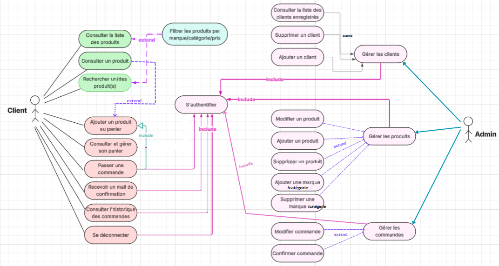

## Diagramme de classe preliminaire
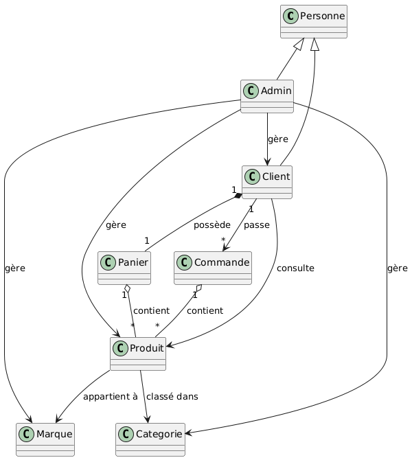

## Diagramme de classe detaille
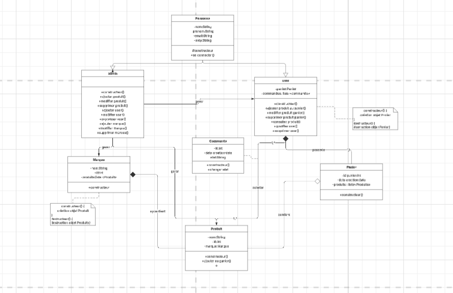


## Les Priorités des cas d’utilisation

Pour le 1er sprint, nous avons choisi :
- Passer une commande
- Ajouter un produit au panier


## Cas d'utilisation de Haute Priorité

### Cas d'utilisation 1 : Ajouter un produit au panier
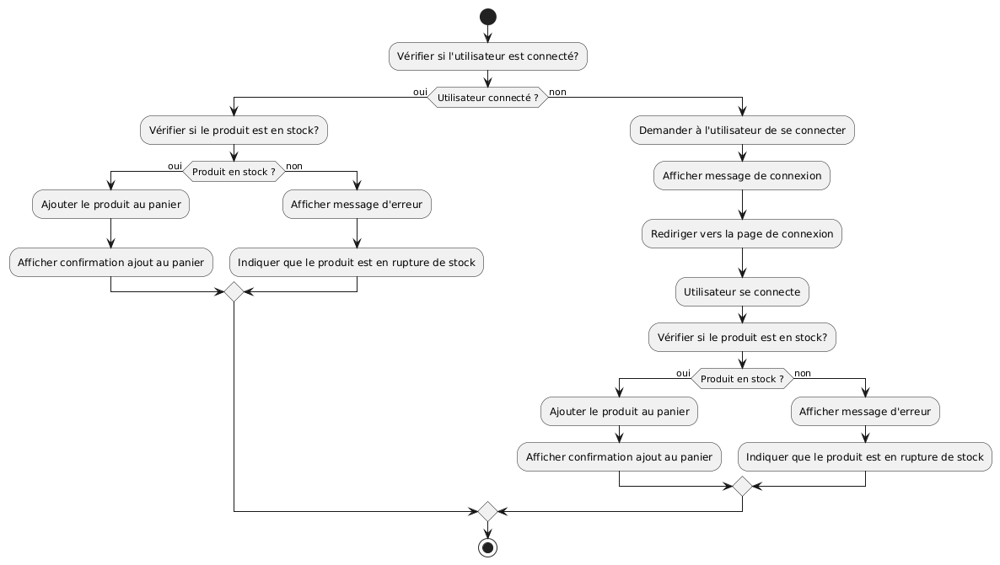

#### Table de décision pour l'ajout d'un produit au panier :
|                              | 1 | 2 | 3 | 4 |
|------------------------------|---|---|---|---|
| **Préconditions**            |   |   |   |   |
| Client connecté              | F | T | T | T |
| Produit disponible en stock  | T | F | T | T |
| Produit non déjà dans panier | T | T | F | T |
| Quantité demandée > 0        | T | T | T | F |
| **Postcondition**            |   |   |   |   |
| Produit ajouté au panier     | F | F | F | F |
| **Nombre de jeux de tests**  | 1 | 1 | n | 1 |

---

## DIAGRAMME DE SEQUENCE
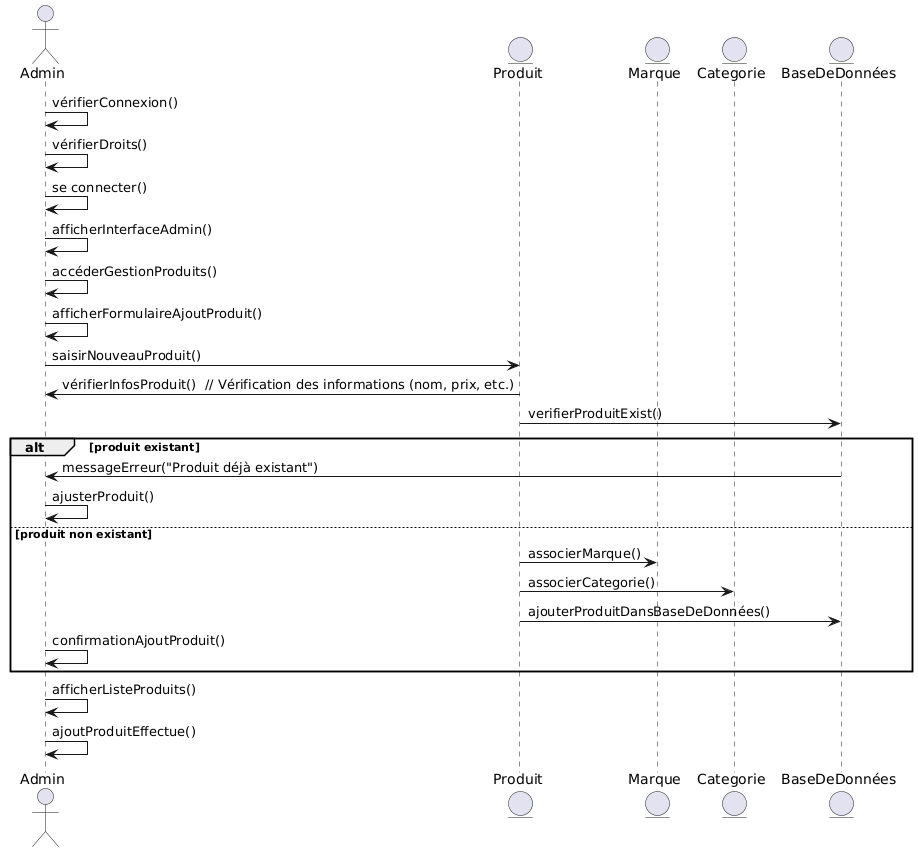

## Algorithme d'ajout de produit

Début  
&nbsp;&nbsp;si vérifierConnexion() alors  
&nbsp;&nbsp;&nbsp;&nbsp;si vérifierDroits() alors  
&nbsp;&nbsp;&nbsp;&nbsp;&nbsp;&nbsp;se connecter()  
&nbsp;&nbsp;&nbsp;&nbsp;&nbsp;&nbsp;afficherInterfaceAdmin()  
&nbsp;&nbsp;&nbsp;&nbsp;&nbsp;&nbsp;accéderGestionProduits()  
&nbsp;&nbsp;&nbsp;&nbsp;&nbsp;&nbsp;afficherFormulaireAjoutProduit()  
&nbsp;&nbsp;&nbsp;&nbsp;&nbsp;&nbsp;produit = saisirNouveauProduit()  
&nbsp;&nbsp;&nbsp;&nbsp;&nbsp;&nbsp;si vérifierInfosProduit(produit) alors  
&nbsp;&nbsp;&nbsp;&nbsp;&nbsp;&nbsp;&nbsp;&nbsp;si verifierProduitExist(produit) alors  
&nbsp;&nbsp;&nbsp;&nbsp;&nbsp;&nbsp;&nbsp;&nbsp;&nbsp;&nbsp;messageErreur("Produit déjà existant")  
&nbsp;&nbsp;&nbsp;&nbsp;&nbsp;&nbsp;&nbsp;&nbsp;&nbsp;&nbsp;ajusterProduit(produit)  
&nbsp;&nbsp;&nbsp;&nbsp;&nbsp;&nbsp;&nbsp;&nbsp;sinon  
&nbsp;&nbsp;&nbsp;&nbsp;&nbsp;&nbsp;&nbsp;&nbsp;&nbsp;&nbsp;associerMarque(produit)  
&nbsp;&nbsp;&nbsp;&nbsp;&nbsp;&nbsp;&nbsp;&nbsp;&nbsp;&nbsp;associerCategorie(produit)  
&nbsp;&nbsp;&nbsp;&nbsp;&nbsp;&nbsp;&nbsp;&nbsp;&nbsp;&nbsp;ajouterProduitDansBaseDeDonnées(produit)  
&nbsp;&nbsp;&nbsp;&nbsp;&nbsp;&nbsp;&nbsp;&nbsp;&nbsp;&nbsp;confirmationAjoutProduit()  
&nbsp;&nbsp;&nbsp;&nbsp;&nbsp;&nbsp;&nbsp;&nbsp;fin si  
&nbsp;&nbsp;&nbsp;&nbsp;&nbsp;&nbsp;afficherListeProduits()  
&nbsp;&nbsp;&nbsp;&nbsp;&nbsp;&nbsp;ajoutProduitEffectué()  
&nbsp;&nbsp;&nbsp;&nbsp;&nbsp;&nbsp;fin si  
&nbsp;&nbsp;&nbsp;&nbsp;fin si  
&nbsp;&nbsp;fin si  
Fin


### Cas d'utilisation 2 : Passer une commande
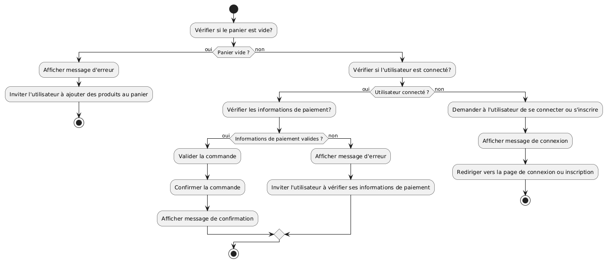

#### Table de décision pour passer une commande :
|  | 1 | 2 | 3 | 4 | 5 |
| --- | --- | --- | --- | --- | --- |
| **Préconditions** | Client connecté | F | T | T | T | T |
|  | Panier non vide |  | F | T | T |
|  | Quantité disponible en stock |  |  | F | T |
|  | Informations de livraison fournies |  |  |  | F | T |
|  | Un mode de paiement choisi |  |  |  |  | T |
| **Postcondition** | Recevoir un mail de confirmation | F | F | F | F | T |
| **Nombre de jeux de tests** | 2 | 2 | 2*n | 1 | 1 |

## DIAGRAMME DE SEQUENCE
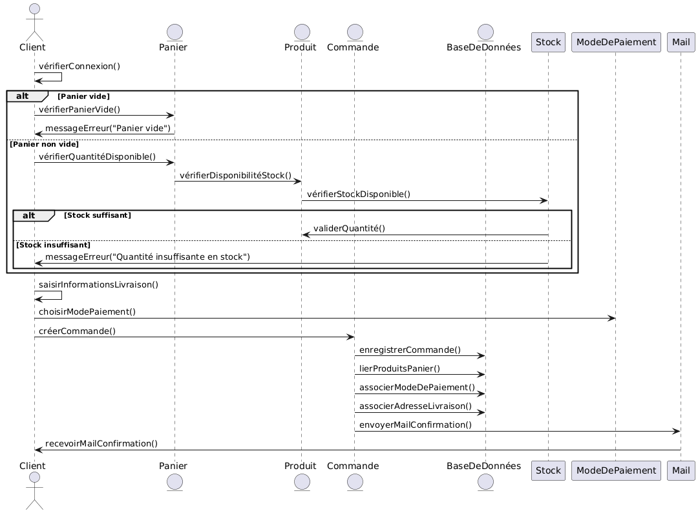
 
## Algorithme de validation de commande

Début  
&nbsp;&nbsp;si vérifierConnexion() alors  
&nbsp;&nbsp;&nbsp;&nbsp;si vérifierPanierVide() alors  
&nbsp;&nbsp;&nbsp;&nbsp;&nbsp;&nbsp;messageErreur("Panier vide")  
&nbsp;&nbsp;&nbsp;&nbsp;sinon  
&nbsp;&nbsp;&nbsp;&nbsp;&nbsp;&nbsp;si vérifierQuantitéDisponible() alors  
&nbsp;&nbsp;&nbsp;&nbsp;&nbsp;&nbsp;&nbsp;&nbsp;si vérifierStockDisponible() alors  
&nbsp;&nbsp;&nbsp;&nbsp;&nbsp;&nbsp;&nbsp;&nbsp;&nbsp;&nbsp;validerQuantité()  
&nbsp;&nbsp;&nbsp;&nbsp;&nbsp;&nbsp;&nbsp;&nbsp;&nbsp;&nbsp;infosLivraison = saisirInformationsLivraison()  
&nbsp;&nbsp;&nbsp;&nbsp;&nbsp;&nbsp;&nbsp;&nbsp;&nbsp;&nbsp;modePaiement = choisirModePaiement()  
&nbsp;&nbsp;&nbsp;&nbsp;&nbsp;&nbsp;&nbsp;&nbsp;&nbsp;&nbsp;commande = créerCommande()  
&nbsp;&nbsp;&nbsp;&nbsp;&nbsp;&nbsp;&nbsp;&nbsp;&nbsp;&nbsp;enregistrerCommande(commande)  
&nbsp;&nbsp;&nbsp;&nbsp;&nbsp;&nbsp;&nbsp;&nbsp;&nbsp;&nbsp;lierProduitsPanier(commande)  
&nbsp;&nbsp;&nbsp;&nbsp;&nbsp;&nbsp;&nbsp;&nbsp;&nbsp;&nbsp;associerModeDePaiement(commande, modePaiement)  
&nbsp;&nbsp;&nbsp;&nbsp;&nbsp;&nbsp;&nbsp;&nbsp;&nbsp;&nbsp;associerAdresseLivraison(commande, infosLivraison)  
&nbsp;&nbsp;&nbsp;&nbsp;&nbsp;&nbsp;&nbsp;&nbsp;&nbsp;&nbsp;envoyerMailConfirmation(commande)  
&nbsp;&nbsp;&nbsp;&nbsp;&nbsp;&nbsp;&nbsp;&nbsp;&nbsp;&nbsp;recevoirMailConfirmation()  
&nbsp;&nbsp;&nbsp;&nbsp;&nbsp;&nbsp;&nbsp;&nbsp;sinon  
&nbsp;&nbsp;&nbsp;&nbsp;&nbsp;&nbsp;&nbsp;&nbsp;&nbsp;&nbsp;messageErreur("Quantité insuffisante en stock")  
&nbsp;&nbsp;&nbsp;&nbsp;&nbsp;&nbsp;&nbsp;&nbsp;fin si  
&nbsp;&nbsp;&nbsp;&nbsp;&nbsp;&nbsp;fin si  
&nbsp;&nbsp;&nbsp;&nbsp;fin si  
&nbsp;&nbsp;fin si  
Fin

## Les diagrammes de machine à etats et leurs traductions

1//User

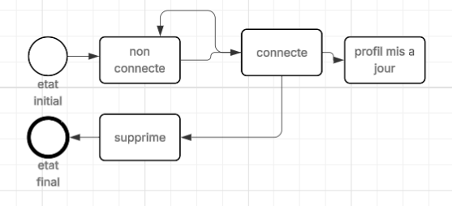

TRADUCTION

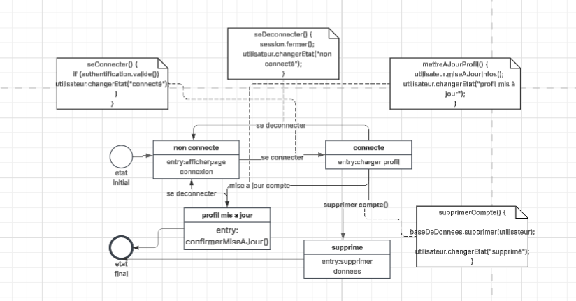

2//Produit

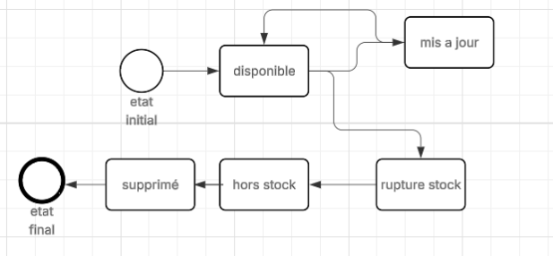

TRADUCTION

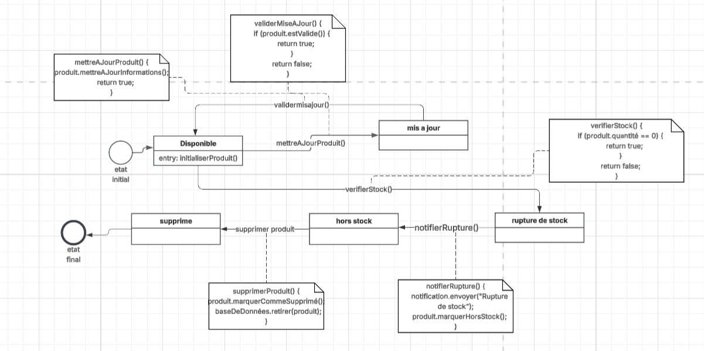

3//Panier

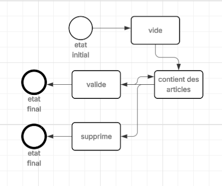

TRADUCTION

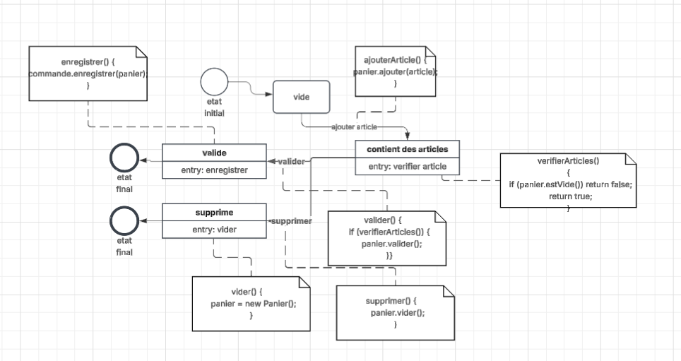

4//Commande

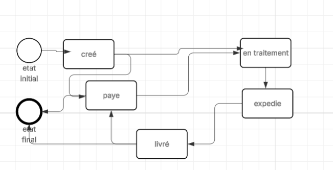

TRADUCTION

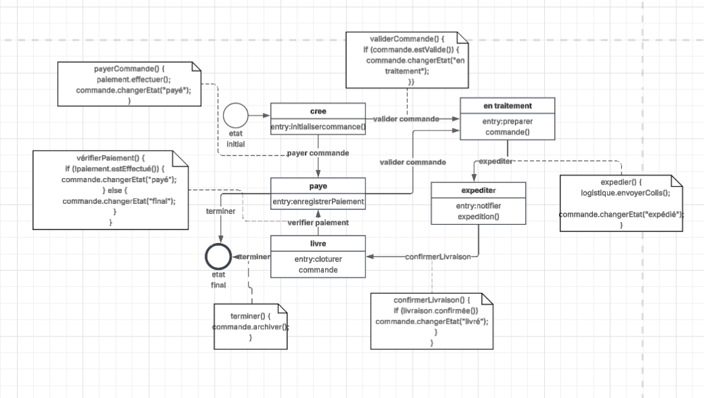
